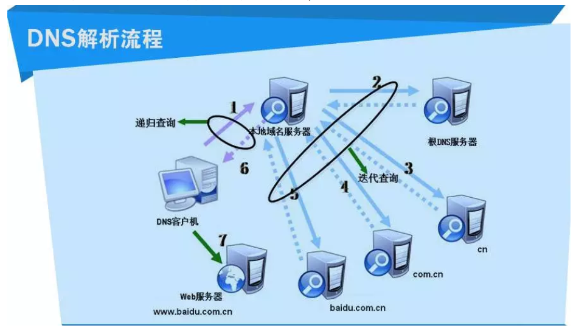
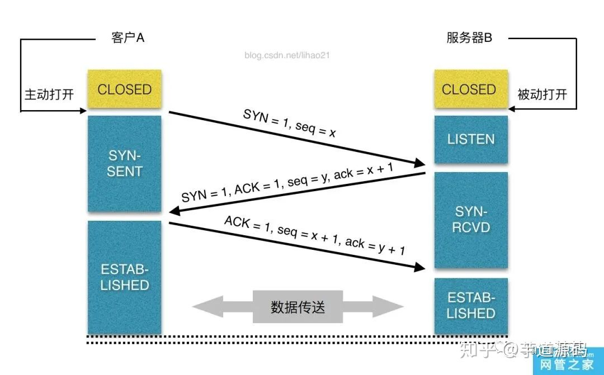
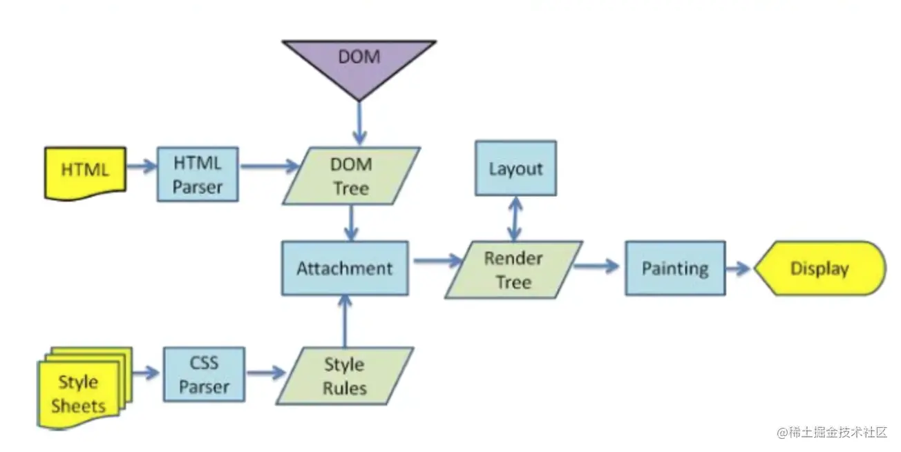

## 从输入 URL 到展示过程

如果有强缓存则直接从缓存中读取数据。没有就走正常解析流程。
[缓存相关](./cache.md)

### 1. DNS 解析（域名-->ip）

#### 查找顺序

1.浏览器缓存：浏览器会按一定的规则缓存 DNS 的记录  
2.操作系统缓存，hosts 文件  
3.路由器缓存  
4.本地 DNS 服务器（本地区 DNS 服务器）  
5.根域名服务器，本地服务器向根域名服务器发起请求，按照域名层级层层查找。  

#### DNS 优化

1.减少 DNS 请求次数，控制域名数量  
2.DNS 预获取，在使用前预先解析 DNS，\<link rel="dns-prefeach" href="www.xxxx.xx">

### 2.建立 TCP 连接

#### 三次握手

位码/TCP 标志位（6 种）：  
SYN(synchronous 建立联机)  
ACK(acknowledgement 确认)  
PSH(push 传送)  
FIN(finish 结束)  
RST(reset 重置)  
URG(urgent 紧急)  
Sequence number(顺序号码)  
Acknowledge number(确认号码)  
1.第一次握手，客户端发送位码 SYN=1,seq=x 的数据包到服务器,然后进入 SYN_SEND 状态.（服务端知道客户端发送，服务端接收能力正常）  
2.第二次握手，服务端收到客户端发送的数据包，由 SYN=1 知道客户端要求建立联机，返回 SYN=1,ACK=1,seq=y,ack=x+1 数据包。（客户端知道服务端发送，接收，客户端发送接收能力正常）  
3.第三次握手，客户端收到以后检查 ACK 是否为 1，ack 是否正确（即第一次握手发送的 seq+1），若正确，则客户端发送 ACK=1,ack=y+1,seq=x+1.服务端收到后检查没问题则建立连接。（服务端知道客户端接收，服务端发送能力正常）  

### 3.客户端发送请求

TCP 三次握手结束后建立连接，开始发送 HTTP 请求报文。

### 4.服务器处理请求并返回 HTTP 报文

服务端处理请求数据，返回响应报文

### 5.浏览器解析渲染页面

浏览器根据 HTML 代码自上而下进行构建  
download、parseHTML/parseCSS/executeJS、layout、paint 都在不同线程中。  
parseHTML/parseCSS 并行，共同完成后才会 layout 生成渲染树，进而 paint 渲染。执行 JS 会重新回到 layout 阶段。

#### 解析流程

浏览器收到 HTML 文件以后，开始并行构建 DOM 树和 CSSOM 树，在遇到：

- 外部 css 资源时，下载和解析都不会阻塞构建 dom 树
- script 标签时，脚本的下载和执行会阻塞 html,css 的解析。js 的执行需要等到 CSSOM 树构建完毕。
- 浏览器的一些优化措施：预解析扫描器，在 HTML 解析过程中将解析可用的内容并请求高优先级资源

defer 和 async  
有些脚步对用户体验可能并不重要，比如那些用于监测和分析的脚本。就要尽可能的异步加载

1. defer 脚本在 HTML 文档解析完全完成之后才开始执行，处在 DOMContentLoaded 事件之前，他保证脚本按照它在 HTML 中出现的顺序执行。
2. async 脚本在完成下载后的第一时间执行，在 load 事件之前。多个 async 脚本的执行顺序不总是按照出现顺序，而是取决于哪个文件先下载完。async 的脚本有较低的优先级，通常在其他脚本加载后才加载。

preload 和 prefetch  
preload 是一个声明式 fetch，可以强制浏览器在不阻塞 document 的 onload 事件的情况下请求资源。例：\<link rel="preload" href="xxx.xx" as="style">  
Prefetch 告诉浏览器这个资源将来可能需要，但是什么时间加载这个资源是由浏览器来决定的。

等到 DOM 树和 CSSOM 树构建完毕，将其按照对应节点一一组合，然后构建 Render 树  
然后 Layout 布局，在渲染树上运行布局以计算每个节点的几何体。布局是确定呈现树中所有节点的宽度、高度和位置，以及确定页面上每个对象的大小和位置的过程  
最后绘制，将上 layout 布局阶段计算的框，图形，颜色，阴影等元素绘制到屏幕上。
