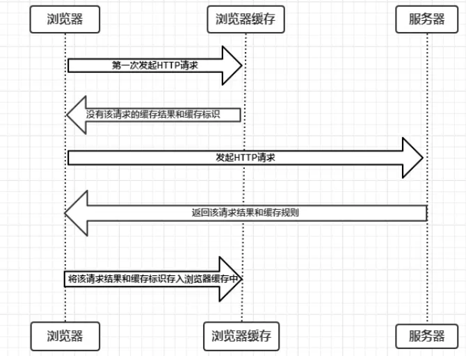
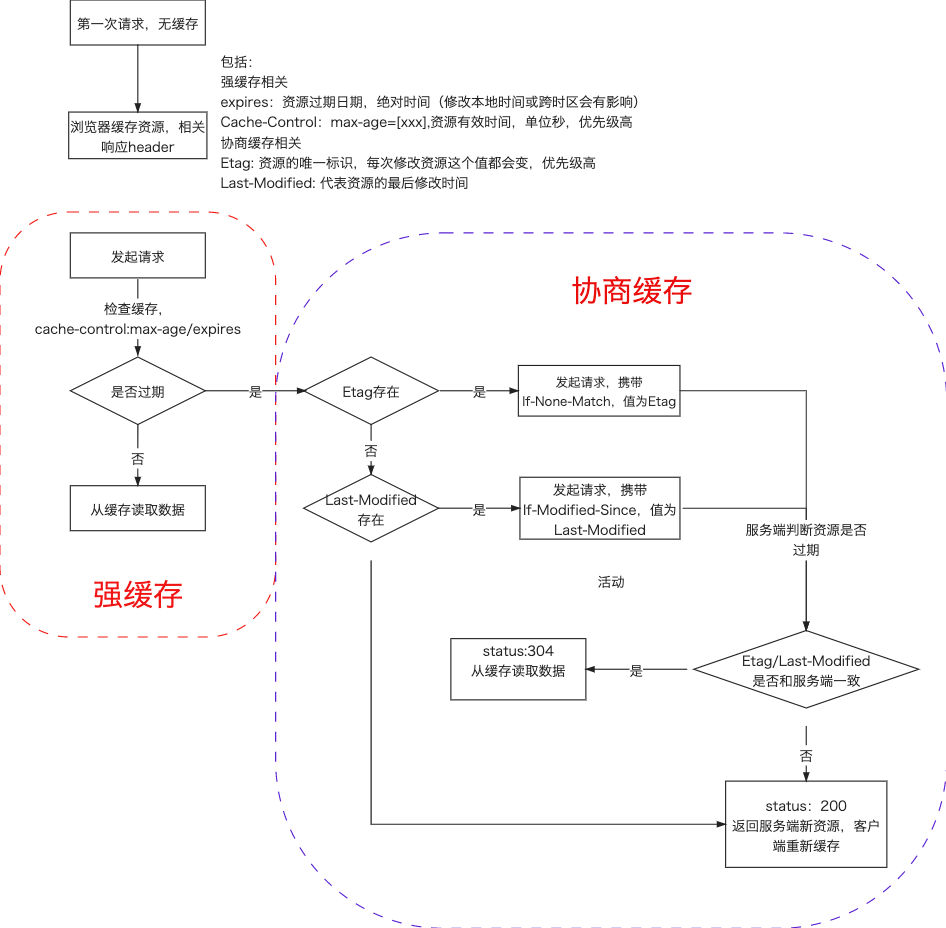

## 浏览器缓存机制

### 缓存位置

#### Service Worker

#### Memory Cache

快速读取: 内存缓存会将编译解析后的文件，直接存入该进程的内存中，占据该进程一定的内存资源，以方便下次运行使用时的快速读取。  
时效性: 一旦该进程关闭，则该进程的内存则会清空。js，字体文件，图片等一般缓存在内存。

#### Disk Cache

硬盘缓存：硬盘缓存则是直接将缓存写入硬盘文件中，读取缓存需要对该缓存存放的硬盘文件进行 I/O 操作，然后重新解析该缓存内容，读取复杂，速度比内存缓存慢。css 一般缓存在硬盘。

#### Puah Cache

### 缓存过程

发起请求，检查浏览器缓存，是否存在缓存，不存在则请求，存在则检查缓存是否过期（Expires,Cache-Control），没过期则使用缓存。  
缓存过期，向服务器发送请求，在第一次请求缓存该资源时服务端的响应参数中包含了 last-modified/Etag（代表资源的最后修改时间/Etag 是资源的一种唯一标识）这个参数，客户端在再次发起请求时会带上 If-Modified-Since/If-None-Match 这个 header，值就是 Last-Modified/Etag 中的值。服务器再次收到这个资源请求，会根据 If-Modified-Since/If-None-Match 中的值与服务器中这个资源的最后修改时间对比/在服务端的 Etag，如果没有变化，返回 304 和空的响应体，直接从缓存读取，如果 If-Modified-Since/If-None-Match 的时间小于服务器中这个资源的最后修改时间/不一致，说明文件有更新，于是返回新的资源文件和 200  
Etag / If-None-Match 优先级高于 Last-Modified / If-Modified-Since，同时存在则只有 Etag / If-None-Match 生效。
